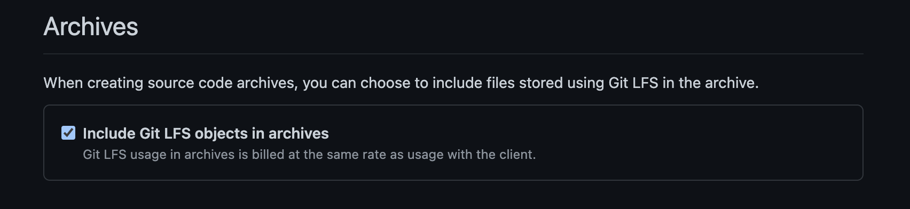
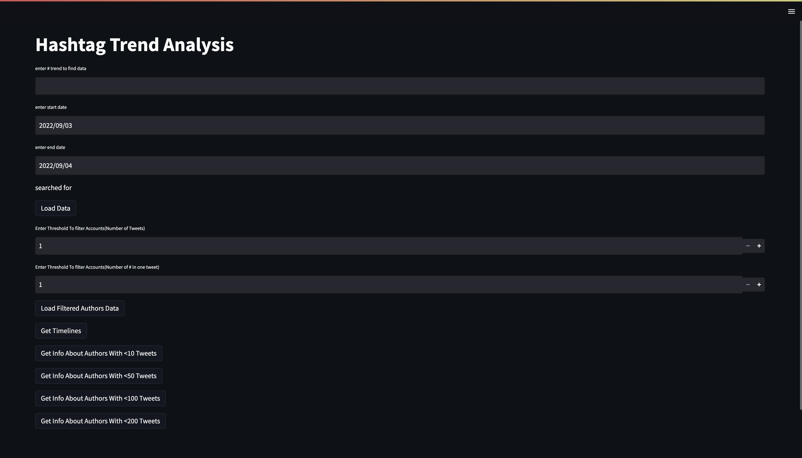

# Project name
Twitter Hashtag Trend Analysis Tool
## Team Members
- Shivansh Sethi
- Rohit

## Tool Description
This sections discusses the purpose and motivation for the tool, and how it addresses a tool need you've identified.

The Main purpose of the tool is for user to analyse bot/propoganda based behaviour during a given timeline on a certain hashtag.
There are very few tools currently which provide an all in one analysis, so we tried to make one that not only helps the user to analyse/visualize the data but also does some analysis itself by maintaining score of the users found based on some parameters that can helps user to filter out the accounts for further analysis.

## Installation
This section includes detailed instructions for installing the tool, including any terminal commands that need to be executed and dependencies that need to be installed. Instructions should be understandable by non-technical users (e.g. someone who knows how to open a terminal and run commands, but isn't necessarily a programmer), for example:

### As this repo contains some git lfs objects and the git lfs bandwidth is limited you have to follow the below steps to doenload the repo.

1. Fork the Following Repository  https://github.com/shivansh-sethi-2000/BellingCat.git

2. Go to your repo Settings

3. Find "Include Git LFS objects in archives" under the Archives section and check it
        

4. Return to the archived repository. 

5. Download as .zip

6. Download will pause for a minute or so before it starts downloading lfs objects. Wait and it should continue.

7. Move to the tool's directory and install the required Packages

        cd BellingCat
        pip install -r req.txt

8. add your API keys and sceret to my_tokens.py file

## Usage
This sections includes detailed instructions for using the tool. If the tool has a command-line interface, include common commands and arguments, and some examples of commands and a description of the expected output. If the tool has a graphical user interface or a browser interface, include screenshots and describe a common workflow.

1. To run the Script use the following command

        streamlit run Hashtag_Trend_Script.py

2. It will Take you to your Web Page If not you can use the Url showing in your terminal

3. The HomePage will Look Like this
    

## Additional Information
This section includes any additional information that you want to mention about the tool, including:
- Potential next steps for the tool (i.e. what you would implement if you had more time)
- Any limitations of the current implementation of the tool
- Motivation for design/architecture decisions
